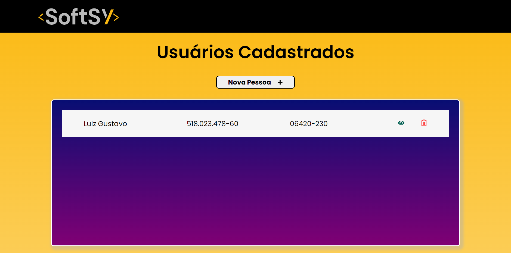

# Softsy - Teste

---

## Sobre

Este projeto representa uma avaliação destinada a testar os conhecimentos para uma oportunidade de emprego na empresa Softsy.

---

## Tecnologias utilizadas

- React.js
- Axios
- Moment

---

## Como rodar a aplicação localmente

- 1º  Baixe todo o projeto e execute o comando "npm i" dentro do projeto.
- 2º  Execute com o comando "npm start"

---

## Links

[Figma](https://www.figma.com/file/ni7z8aOI8GgeZKUe6VFeKa/Softsy?type=design&node-id=0%3A1&mode=design&t=XErNBnnskF38NEzG-1).
[Deploy]().
